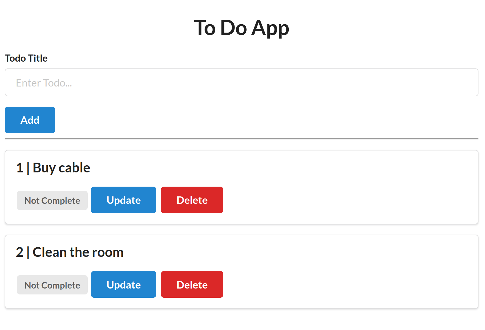

# Instructions

* Reference was taken from here: https://youtu.be/3vfum74ggHE?t=308


* install the prerequisites in the `Pipfile`


## Setting up the sqlite

* First install sqlite:

```linux
sudo apt install sqlite3
```

* run the command:

```linux
sqlite3
```

* Create a database using `my_db.sqlite` and create table `todos`.

```commandline
.open my_db.sqlite

CREATE TABLE todos(                                                                                    
        id INTEGER INDEX PRIMARY KEY,                                                                           
        title STRING,                                                                                           
        complete Boolean        
);
```

* copy the file: `my_db.sqlite` to the code directory.
* Run the app
* The routes is written in the app.py

<p align="center"> <!-- style="width:400px;" -->
  
</p>

## Getting the routes 

Fo getting all routes in a clear manner, goto:

http://0.0.0.0:8000/docs


## Setting up mysql

https://blog.balasundar.com/building-a-crud-app-with-fastapi-and-mysql